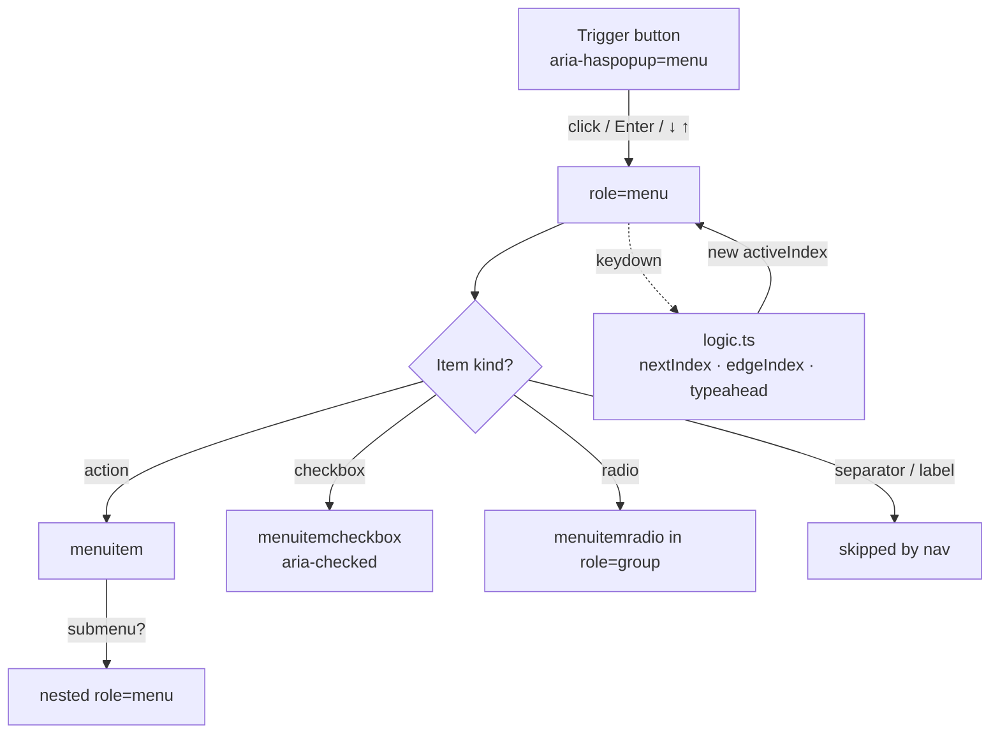

<p align="center">
  
</p>

<h1 align="center">react-dropdown-menu</h1>

<p align="center">
  <strong>The accessible React dropdown menu, done right.</strong><br>
  Submenus, checkbox &amp; radio items, type-ahead, controlled state, placement — and a full WAI-ARIA menu pattern.
</p>

<p align="center">
  <em>Built and maintained by <a href="https://viprasol.com">Viprasol Tech</a> — Fintech Experts. Full-Stack Builders.</em>
</p>

<p align="center">
  <a href="https://github.com/Viprasol-Tech/react-dropdown-menu/actions/workflows/ci.yml"></a>
  <a href="LICENSE"></a>
  
  =18">
  
  
  <a href="https://t.me/viprasol_help"></a>
</p>

---

## ✨ Features

- ♿ **Full ARIA menu pattern** — `menu` / `menuitem` / `menuitemcheckbox` / `menuitemradio`, roving tabindex, focus management, and correct `aria-*` wiring.
- 🪜 **Submenus** — nest items arbitrarily; open with `→` / click, close with `←`, with `aria-haspopup` + `aria-expanded` on the parent.
- ☑️ **Checkbox & radio items** — controlled `checked` / `value` with `onCheckedChange` / `onValueChange`.
- ➖ **Separators & section labels** — visual structure that keyboard navigation skips automatically.
- ⌨️ **Keyboard everything** — `↑`/`↓` (with looping), `Home`/`End`, `Enter`/`Space`, `Esc`, `Tab`.
- 🔤 **Type-ahead** — type to jump; repeated keys cycle through matching items, just like a native menu.
- 🎛️ **Controlled or uncontrolled** — `open` / `defaultOpen` / `onOpenChange`, plus `closeOnSelect`.
- 📍 **Placement** — `bottom-start`, `bottom-end`, `top-start`, `top-end`, and bare `top`/`bottom`.
- 🧮 **Tested pure core** — `nextIndex()`, `edgeIndex()`, and `typeahead()` are framework-free and unit-tested.
- 🔒 **Strictly typed** — TypeScript `strict`, discriminated-union item model, ships `.d.ts`.

## 📦 Install

```bash
npm install react-dropdown-menu
```

```bash
pnpm add react-dropdown-menu
# or: yarn add react-dropdown-menu
```

> Requires `react` and `react-dom` `>= 18` as peer dependencies.

## 🚀 Usage

### Basic

```tsx
import { DropdownMenu, type DropdownItem } from "react-dropdown-menu";

const items: DropdownItem[] = [
  { id: "edit", label: "Edit" },
  { id: "dup", label: "Duplicate" },
  { id: "del", label: "Delete", disabled: true },
];

export function Demo() {
  return (
    <DropdownMenu
      label="Actions"
      items={items}
      onSelect={(id, detail) => console.log("selected", id, detail)}
    />
  );
}
```

### Submenus, separators, checkbox & radio items

```tsx
import { useState } from "react";
import { DropdownMenu, type DropdownItem } from "react-dropdown-menu";

export function FileMenu() {
  const [wrap, setWrap] = useState(true);
  const [theme, setTheme] = useState("system");

  const items: DropdownItem[] = [
    { type: "label", id: "hdr", label: "File" },
    { id: "new", label: "New", shortcut: "⌘N" },
    {
      id: "share",
      label: "Share",
      submenu: [
        { id: "email", label: "Email" },
        { id: "link", label: "Copy Link" },
      ],
    },
    { type: "separator", id: "sep1" },
    {
      type: "checkbox",
      id: "wrap",
      label: "Word Wrap",
      checked: wrap,
      onCheckedChange: setWrap,
    },
    {
      type: "radio-group",
      id: "theme",
      label: "Theme",
      value: theme,
      onValueChange: setTheme,
      items: [
        { type: "radio", id: "t-light", label: "Light", value: "light" },
        { type: "radio", id: "t-dark", label: "Dark", value: "dark" },
        { type: "radio", id: "t-sys", label: "System", value: "system" },
      ],
    },
  ];

  return <DropdownMenu label="File" items={items} placement="bottom-end" />;
}
```

### Controlled open state

```tsx
const [open, setOpen] = useState(false);

<DropdownMenu
  label="Menu"
  items={items}
  open={open}
  onOpenChange={setOpen}
  closeOnSelect={false}
/>;
```

## 🧩 Architecture



The keyboard math lives in a pure, framework-free `logic.ts` so it can be reasoned
about and unit-tested in isolation; the component is a thin, accessible shell around it.

## 📚 Props / API

### `<DropdownMenu>` props

| Prop               | Type                                            | Default          | Description |
| ------------------ | ----------------------------------------------- | ---------------- | ----------- |
| `label`            | `ReactNode`                                     | —                | Trigger button content. |
| `items`            | `DropdownItem[]`                                | —                | Menu entries (union of item kinds below). |
| `onSelect`         | `(id: string, detail: SelectDetail) => void`    | —                | Fired when an item is activated. |
| `loop`             | `boolean`                                        | `true`           | Wrap arrow navigation at the ends. |
| `placement`        | `Placement`                                      | `"bottom-start"` | Where the menu opens relative to the trigger. |
| `open`             | `boolean`                                         | —                | Controlled open state. |
| `defaultOpen`      | `boolean`                                         | `false`          | Initial open state (uncontrolled). |
| `onOpenChange`     | `(open: boolean) => void`                        | —                | Notified when the menu wants to open/close. |
| `closeOnSelect`    | `boolean`                                         | `true`           | Close the menu after activating an item. |
| `disabled`         | `boolean`                                         | `false`          | Disable the whole trigger. |
| `typeAhead`        | `boolean`                                         | `true`           | Enable type-to-focus matching. |
| `typeAheadTimeout` | `number`                                         | `500`            | Idle window (ms) before the type-ahead buffer resets. |
| `ariaLabel`        | `string`                                         | —                | Accessible label when `label` is non-textual. |
| `className`        | `string`                                         | —                | Class on the root wrapper. |
| `menuClassName`    | `string`                                         | —                | Class on the menu surface. |

### Item kinds (`DropdownItem`)

| `type`         | Key fields                                                        | Renders as          |
| -------------- | ---------------------------------------------------------------- | ------------------- |
| `"action"` *(default)* | `id`, `label`, `disabled?`, `icon?`, `shortcut?`, `submenu?` | `menuitem`          |
| `"checkbox"`   | `id`, `label`, `checked`, `onCheckedChange?`                      | `menuitemcheckbox`  |
| `"radio-group"`| `id`, `value`, `onValueChange?`, `items: DropdownRadioItem[]`     | `role="group"`      |
| `"radio"`      | `id`, `label`, `value`                                            | `menuitemradio`     |
| `"separator"`  | `id`                                                              | `role="separator"`  |
| `"label"`      | `id`, `label`                                                     | section heading     |

### Exported helpers

| Export                              | Description |
| ----------------------------------- | ----------- |
| `nextIndex(current, len, dir, loop)`| Pure roving-tabindex math. |
| `edgeIndex(edge, len)`              | Resolve `Home`/`End` targets. |
| `typeahead(state, char, labels, current, now?, timeoutMs?)` | Pure type-ahead matcher. |
| `emptyTypeahead()`                  | A fresh type-ahead state. |
| `placementSide` / `placementAlign`  | Decompose a `Placement`. |

### Keyboard reference

| Context | Keys | Action |
| ------- | ---- | ------ |
| Trigger | `Enter` `Space` `↓` | Open to first item |
| Trigger | `↑` | Open to last item |
| Menu    | `↑` `↓` | Move active item (skips disabled) |
| Menu    | `Home` `End` | Jump to first / last |
| Menu    | `Enter` `Space` | Activate active item |
| Menu    | `→` | Open submenu (on a submenu parent) |
| Menu    | `←` | Close current submenu |
| Menu    | `Esc` | Close and return focus to trigger |
| Menu    | `Tab` | Close without trapping focus |
| Menu    | any letter | Type-ahead to matching item |

## 🗺️ Roadmap

- [x] Submenus, separators, labels
- [x] Checkbox & radio items with ARIA
- [x] Type-ahead matching
- [x] Controlled open state + placement
- [ ] Collision-aware auto-flip placement
- [ ] Portal / `position: fixed` rendering option
- [ ] `onSelect` async guard (keep open until promise resolves)
- [ ] Headless render-prop variant

## ❓ FAQ

**Does it ship styles?** No — it's headless. Style via `className` / `menuClassName`
and the `data-rdm-*` / `data-active` hooks. You stay in control of the look.

**Is the v0.1 API still supported?** Yes. Plain `{ id, label, disabled }` items keep
working as action items; the only change is `onSelect` now passes a second detail arg.

**Does type-ahead work with non-string labels?** Yes — pass `textValue` on the item
to provide the text used for matching when `label` is a React node.

**How is keyboard logic tested?** The navigation and type-ahead math are pure functions
in `logic.ts` with dedicated unit tests, plus component-level interaction tests with
`@testing-library/react`.

## 🤝 Contributing

PRs welcome — see [CONTRIBUTING.md](CONTRIBUTING.md) and our [Code of Conduct](CODE_OF_CONDUCT.md).
Run `npm install`, then `npm run typecheck` and `npm test` before opening a PR.

## Contact — Viprasol Tech Private Limited

- Website: [viprasol.com](https://viprasol.com)
- Email: [support@viprasol.com](mailto:support@viprasol.com)
- Telegram: [t.me/viprasol_help](https://t.me/viprasol_help) | WhatsApp: +91 96336 52112
- GitHub: [@Viprasol-Tech](https://github.com/Viprasol-Tech) | [LinkedIn](https://www.linkedin.com/in/viprasol/) | X [@viprasol](https://twitter.com/viprasol)

## License

[MIT](LICENSE) (c) 2025 Viprasol Tech Private Limited
